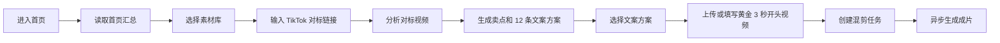

# TK 首页后端接口与业务逻辑说明

本文档梳理管理后台 TK 首页 `src/views/tk/dashboard/index.vue` 当前实际依赖的后端接口，并用业务语言说明每个接口背后的处理逻辑。

前端请求会统一加上环境配置里的接口前缀。以本地环境为例，页面访问的真实地址是：

- 前端页面：`http://127.0.0.1:5173/tk/dashboard`
- 后端服务：`http://localhost:48080`
- 接口前缀：`/admin-api`

所以下文接口 `/tk/dashboard/summary` 的实际请求地址是 `/admin-api/tk/dashboard/summary`。

## 页面整体业务链路

首页不是单纯展示静态数据，而是围绕一条完整的 TikTok 混剪业务链路组织：

1. 用户进入首页，系统读取首页汇总数据和素材库数据。
2. 用户输入 TikTok 对标视频链接，并选择素材库。
3. 用户点击“开始分析”，后端根据链接和素材库信息生成一份对标分析记录，同时生成 12 条可选文案方案。
4. 用户选择其中一条文案方案，并上传黄金 3 秒视频或填写开头视频链接。
5. 用户点击“生成混剪视频”，后端创建生成任务，并立即提交到异步混剪流水线。
6. 流水线依次完成文案确认、AI 配音、素材匹配、FFmpeg 合成、成片上传，并更新任务状态。

## 通用权限和数据范围逻辑

TK 模块所有首页相关接口都先经过登录态和权限校验。

权限校验通过 `@PreAuthorize("@ss.hasPermission('...')")` 控制。用户没有对应权限时，接口会返回无权限错误；未登录时返回登录错误。

数据范围由 `TkDataScopeService` 统一控制：

- 平台管理员 `PLATFORM_ADMIN` 可以读取所有公司的数据，但创建或写入数据时必须显式传入 `companyId`。
- 公司管理员和公司用户只能读取、写入自己 `tk_company_id` 对应公司的数据。
- 如果当前用户没有配置 TK 用户级别，或公司用户没有配置所属公司，接口会拒绝访问。
- 写入类接口会校验目标素材库、对标分析、文案方案是否属于同一家公司，避免跨公司或跨素材库误用。

## 1. 首页汇总接口

### 接口

- 方法：`GET`
- 路径：`/tk/dashboard/summary`
- 权限：`tk:dashboard:query`
- 前端调用位置：页面初始化 `getData()`

### 页面用途

首页首次加载时调用该接口，用来填充右侧“今日数据”和底部“素材库概览”的基础数据。

页面主要使用这些返回值：

- `generatedVideoCount`：生成视频数
- `materialVideoCount`：素材视频数
- `parsingVideoCount`：解析中的素材视频数
- `estimatedOrders`：预计订单数
- `libraries`：首页展示用的前 5 个素材库
- `recentTasks`：最近生成任务，当前页面已读取但暂未明显展示

### 后端逻辑

后端会先获取当前登录用户的数据范围，然后按数据范围统计数据。

如果当前用户是平台管理员，统计时不限制公司；如果是公司用户，只统计当前用户所属公司的数据。

具体处理逻辑：

1. 查询当前用户的 TK 用户级别和所属公司。
2. 统计当前数据范围内的生成任务数量，作为生成视频数。
3. 统计当前数据范围内的素材视频数量。
4. 统计状态为 `PARSING` 的素材视频数量，作为解析中素材数。
5. 估算订单数目前是规则值：平台管理员返回 `342`，普通公司范围返回 `128`。
6. 查询最近的 5 个素材库，用于首页素材库概览。
7. 查询最近的 5 个生成任务，用于首页最近任务数据。
8. 将数据库对象转换为首页汇总 VO 返回。

### 相关后端文件

- `TkDashboardController`
- `TkDashboardServiceImpl`
- `TkMaterialLibraryMapper`
- `TkMaterialVideoMapper`
- `TkGenerationTaskMapper`

## 2. 素材库分页接口

### 接口

- 方法：`GET`
- 路径：`/tk/material-library/page`
- 权限：`tk:material-library:query`
- 前端调用位置：页面初始化 `getData()`

### 页面用途

首页优先使用 `/tk/dashboard/summary` 返回的 `libraries` 作为素材库下拉框数据。

如果汇总接口没有返回素材库，页面会兜底调用素材库分页接口，取前 10 个素材库，用于“素材库（必选）”下拉选择和“素材库概览”展示。

### 请求参数

首页当前传入：

- `pageNo = 1`
- `pageSize = 10`

接口本身还支持按以下条件筛选：

- `companyId`
- `name`
- `category`
- `status`

### 后端逻辑

后端会按当前用户的数据范围查询素材库分页。

具体处理逻辑：

1. 判断当前用户是平台管理员还是公司用户。
2. 如果是平台管理员，可以按请求里的 `companyId` 过滤；如果不传，则查全部公司。
3. 如果是公司用户，忽略跨公司的查询意图，只查当前用户所属公司的素材库。
4. 根据素材库名称、类目、状态做可选过滤。
5. 按素材库 ID 倒序返回分页结果。

### 页面依赖字段

首页主要使用：

- `id`：生成任务和对标分析都必须绑定素材库 ID。
- `companyId`：平台管理员创建分析或任务时需要传入公司 ID。
- `name`：展示素材库名称，也会被后端用于生成文案。
- `category`、`scene`、`tags`：后端对标分析和 AI 文案生成时会作为业务上下文。
- `coverUrl`、`videoCount`：首页素材库概览展示用。

## 3. 对标分析接口

### 接口

- 方法：`POST`
- 路径：`/tk/reference/analyze`
- 权限：`tk:reference:analyze`
- 前端调用位置：
  - 点击“开始分析”
  - 点击“重新生成”
  - 点击“换一批文案”
  - 点击“生成混剪视频”时，如果还没有完成分析，页面会先自动调用一次分析

### 页面用途

这是首页从“演示页面”变成“真实业务”的核心接口。

用户输入 TikTok 链接并选择素材库后，页面把链接、素材库、参考时长提交给后端。后端生成并保存一份对标分析结果，同时保存 12 条文案方案。页面拿到返回结果后，用它替换原来的静态卖点和静态文案。

### 请求数据

首页当前传入：

- `sourceUrl`：TikTok 对标视频链接，必填。
- `libraryId`：素材库 ID，必填。
- `referenceDuration`：参考视频时长，默认 30 秒。
- `companyId`：当前素材库所属公司 ID。平台管理员写入时必须传；公司用户可不传。
- `forceRefresh`：是否强制重新分析。

### 后端核心逻辑

后端处理时会分为“复用已有分析”和“生成新分析”两条路径。

#### 复用已有分析

如果 `forceRefresh` 不是 `true`，后端会先查同一个素材库、同一个 TikTok 链接下最近一次成功保存的分析结果。

如果找到了历史分析，后端不会重新调用 AI，也不会重复插入数据，而是直接把历史分析和它关联的文案方案返回给前端。这样可以减少重复消耗，也能保证同一个链接多次打开时结果稳定。

#### 生成新分析

如果没有历史分析，或者用户点击的是“重新生成 / 换一批文案”，前端会传 `forceRefresh = true`，后端会生成一份新的分析。

新分析的业务过程如下：

1. 校验素材库是否存在，且当前用户有权限读取该素材库。
2. 根据用户身份确认写入公司。如果是平台管理员，必须指定 `companyId`；如果是公司用户，使用用户自己的公司。
3. 校验请求公司和素材库所属公司一致，防止把 A 公司的分析写到 B 公司的素材库下。
4. 组装 AI 分析提示词。提示词会包含：
   - TikTok 对标链接
   - 素材库名称
   - 类目
   - 场景
   - 标签
   - 参考视频时长
5. 调用 Gemini 文本模型，要求 AI 返回结构化 JSON。
6. 解析 AI JSON，提取：
   - 产品名
   - 视频时长
   - 发布时间
   - 核心卖点
   - 目标人群
   - 使用场景
   - 视频结构
   - 卖点卡片
   - 12 条文案方案
7. 如果 AI 调用失败、未配置 API Key、返回内容不合法，后端会使用规则兜底生成结果。兜底结果会基于素材库名称、标签、场景生成，不会让前端空白。
8. 保存一条 `tk_reference_analysis` 记录。
9. 保存 12 条 `tk_reference_script_option` 记录，每条记录都绑定分析 ID、素材库 ID 和公司 ID。
10. 查询刚保存的文案方案并返回给前端。

### 返回数据如何驱动页面

页面会把返回数据拆成三块展示：

- `analysisResult`：展示到“AI分析结果”列表。
- `sellingPoints`：解析成“AI提炼卖点细节”卡片。
- `scriptOptions`：展示到“AI生成文案标题”表格，并供用户选择。

其中 `analysisResult` 和 `sellingPoints` 在后端是 JSON 字符串，前端会解析后渲染。

### 相关数据表

- `tk_reference_analysis`：保存一次对标分析的主体结果。
- `tk_reference_script_option`：保存该分析下生成的文案方案。

## 4. 最近一次对标分析接口

### 接口

- 方法：`GET`
- 路径：`/tk/reference/latest`
- 权限：`tk:reference:query`
- 前端封装位置：`src/api/tk/reference/index.ts`

### 当前页面使用情况

该接口已经在前端 API 层封装，但当前首页主流程没有主动调用它。

目前首页点击“开始分析”时直接调用 `/tk/reference/analyze`。而 `analyze` 接口内部已经包含“查最近一次分析并复用”的逻辑，所以页面暂时不需要单独调 `latest`。

### 后端逻辑

该接口用于按 `libraryId + sourceUrl` 查询最近一次分析。

处理逻辑：

1. 校验素材库存在且当前用户可读。
2. 按当前用户数据范围查询对应链接最近一次分析。
3. 如果找到分析，连同文案方案一起返回。
4. 如果没有找到，返回空数据。

该接口适合未来做“用户输入链接后自动回填历史分析”的体验优化。

## 5. 创建生成任务接口

### 接口

- 方法：`POST`
- 路径：`/tk/generation/create`
- 权限：`tk:generation:create`
- 前端调用位置：用户填写“开头视频链接”时点击“生成混剪视频”

### 页面用途

当用户不上传本地文件，而是填写一个远程开头视频链接时，首页会调用这个 JSON 接口创建混剪任务。

### 请求数据

首页当前传入：

- `companyId`：素材库所属公司 ID。
- `sourceUrl`：TikTok 对标链接。
- `libraryId`：素材库 ID。
- `referenceAnalysisId`：用户当前使用的对标分析 ID。
- `scriptOptionId`：用户选择的文案方案 ID。
- `referenceDuration`：目标参考时长。
- `promptText`：选中文案的完整口播文本，兜底为文案标题。
- `openingVideoUrl`：远程黄金 3 秒视频链接。
- `openingVideoName`：远程视频显示名，当前传“远程黄金三秒视频”。

### 后端逻辑

后端创建任务时不只是插入一条记录，还会立即把任务提交到异步生成流水线。

创建任务的处理逻辑：

1. 校验素材库存在，且当前用户可读。
2. 根据当前用户身份确认写入公司。
3. 校验写入公司和素材库所属公司一致。
4. 如果传了远程开头视频链接，就把它作为任务的黄金 3 秒开头视频。
5. 校验 `referenceAnalysisId` 是否存在，且该分析属于当前公司和当前素材库。
6. 校验 `scriptOptionId` 是否存在，且该文案方案属于当前公司、当前素材库；如果同时传了分析 ID，还要校验文案方案属于这次分析。
7. 生成任务默认状态为 `PENDING`，进度为 `0`。
8. 设置任务标题为“素材库名称 · 智能混剪任务”。
9. 保存到 `tk_generation_task`。
10. 调用生成流水线，把任务 ID 提交到后台线程池异步执行。
11. 返回生成任务 ID。

### 业务保护

这个接口会防止三类错误：

- 用不存在或无权访问的素材库创建任务。
- 用其他公司的素材库创建本公司的任务。
- 用不属于当前素材库的分析记录或文案方案创建任务。

## 6. 创建生成任务（含本地开头视频）接口

### 接口

- 方法：`POST`
- 路径：`/tk/generation/create-with-opening`
- 请求类型：`multipart/form-data`
- 权限：`tk:generation:create`
- 前端调用位置：用户上传本地黄金 3 秒视频时点击“生成混剪视频”

### 页面用途

当用户通过拖拽上传组件上传本地视频文件时，首页会调用这个接口。它和 `/tk/generation/create` 的区别是：该接口先把本地视频上传到文件服务，再把上传后的 URL 写入生成任务。

### 请求数据

除普通生成任务参数外，还会多传一个文件字段：

- `openingVideoFile`：本地上传的视频文件。

### 后端文件校验逻辑

后端会先校验上传文件：

1. 文件不能为空。
2. 文件大小不能超过 100MB。
3. 文件扩展名只允许 `mp4`、`mov`、`webm`。
4. 校验通过后，将文件上传到文件服务目录：`tk/{tenantId}/{companyId}/generation-openings`。
5. 文件服务返回的 URL 会作为任务的 `openingVideoUrl`。

后续任务创建、分析记录校验、文案方案校验、流水线提交逻辑，与 `/tk/generation/create` 一致。

## 7. 生成任务异步流水线

首页创建任务后，后端不会在 HTTP 请求里同步生成完整视频，而是立即返回任务 ID，并把任务放入后台线程池。

后台流水线由 `DefaultTkGenerationPipelineService` 执行，状态会按阶段更新。

### 阶段一：分析和确认文案

任务状态更新为：

- `ANALYZING`
- 进度 `10`

如果任务绑定了 `scriptOptionId`，后端会直接读取用户在首页选择的文案方案。此时不会重新生成文案，保证“用户页面上选中的文案”和“最终视频使用的文案”一致。

如果任务没有绑定文案方案，后端会根据素材库信息、对标链接和默认提示词调用 Gemini 文本模型生成一份新文案。

文案确认后，任务状态更新为：

- `SCRIPT_READY`
- 进度 `30`

并写入：

- `title`
- `referenceDuration`
- `targetDuration`
- `scriptText`

### 阶段二：AI 配音和字幕

后端把最终文案交给 Gemini TTS 模型生成音频。

同时后端会根据文案自动切分字幕。字幕切分规则比较简单：按句号、问号、感叹号、分号等标点切句，每句默认 3 秒，生成 SRT 文件。

音频和字幕都会上传到文件服务目录：

`tk/{tenantId}/{companyId}/generation-tasks/{taskId}`

任务状态更新为：

- `VOICE_READY`
- 进度 `50`

并写入：

- `audioUrl`
- `subtitleUrl`

### 阶段三：素材匹配和片段计划

后端会读取任务绑定的素材库下所有素材视频。

如果用户上传或填写了黄金 3 秒开头视频，后端会把它固定放到片段计划第一段，类型为 `OPENING`，时长 3 秒。

然后后端根据文案文本和素材视频标签做匹配：

1. 素材标签按逗号拆分。
2. 如果文案里包含某个标签，该素材加 1 分。
3. 按匹配分数从高到低排序。
4. 从排序后的素材里循环取片段，每段默认裁剪 3 秒。
5. 直到补齐目标视频时长。

如果素材库里没有可用视频，流水线会失败，任务状态变成 `FAILED`。

片段计划生成后，任务状态更新为：

- `MATERIAL_MATCHED`
- 进度 `65`

并写入：

- `clipPlan`

### 阶段四：FFmpeg 合成视频

后端进入渲染阶段后，任务状态更新为：

- `RENDERING`
- 进度 `80`

渲染逻辑：

1. 下载片段计划中的所有视频 URL，包括远程黄金 3 秒开头视频和素材库视频。
2. 用 FFmpeg 按计划裁剪每个片段。
3. 将每个片段统一处理为 1080x1920 竖屏视频。
4. 拼接所有片段成一个无声视频。
5. 下载配音音频和字幕文件。
6. 用 FFmpeg 将视频、配音、字幕合成为最终视频。
7. 将最终 MP4 上传到文件服务。
8. 将片段计划 JSON 也上传到文件服务，便于追踪生成过程。

合成后任务状态先更新为：

- `EXPORTING`
- 进度 `95`

最终成功后更新为：

- `SUCCESS`
- 进度 `100`

如果任一阶段抛出异常，任务状态会更新为：

- `FAILED`
- 进度 `100`
- `failReason` 记录失败原因

## 8. 数据表关系

首页业务主要涉及以下表：

### `tk_material_library`

素材库主表。首页用它提供素材库选择，后端用它提供类目、场景、标签等 AI 分析上下文。

### `tk_material_video`

素材视频表。生成任务进入素材匹配阶段时，会读取任务素材库下的视频，用于裁剪和混剪。

### `tk_reference_analysis`

对标分析主表。一次 TikTok 链接分析会保存为一条记录。

重要字段：

- `company_id`
- `library_id`
- `source_url`
- `product_name`
- `video_duration`
- `core_selling_points`
- `target_audience`
- `usage_scenarios`
- `video_structure`
- `analysis_result`
- `selling_points`
- `status`

### `tk_reference_script_option`

对标分析下的文案方案表。一条分析默认生成 12 条文案方案。

重要字段：

- `analysis_id`
- `company_id`
- `library_id`
- `option_no`
- `title`
- `points`
- `estimated_conversion_rate`
- `conversion_level`
- `script_text`
- `selected`

### `tk_generation_task`

生成任务表。用户点击“生成混剪视频”后会插入一条任务。

重要字段：

- `source_url`
- `library_id`
- `reference_analysis_id`
- `script_option_id`
- `opening_video_url`
- `opening_video_name`
- `reference_duration`
- `target_duration`
- `clip_seconds`
- `prompt_text`
- `script_text`
- `audio_url`
- `subtitle_url`
- `clip_plan`
- `status`
- `progress`
- `output_url`
- `fail_reason`

## 9. 首页按钮与接口对应关系

| 页面动作 | 调用接口 | 说明 |
| --- | --- | --- |
| 打开首页 | `GET /tk/dashboard/summary` | 加载今日数据、素材库概览、最近任务 |
| 首页汇总未返回素材库 | `GET /tk/material-library/page` | 兜底加载素材库下拉框 |
| 点击“开始分析” | `POST /tk/reference/analyze` | 生成或复用对标分析，返回卖点和文案方案 |
| 点击“重新生成” | `POST /tk/reference/analyze` | `forceRefresh=true`，强制生成新分析和新文案 |
| 点击“换一批文案” | `POST /tk/reference/analyze` | 同样强制刷新分析和文案方案 |
| 点击“生成混剪视频”，且上传了本地视频 | `POST /tk/generation/create-with-opening` | 上传黄金 3 秒视频并创建生成任务 |
| 点击“生成混剪视频”，且填写了视频链接 | `POST /tk/generation/create` | 使用远程视频 URL 创建生成任务 |

## 10. 当前页面未真正触发的封装接口

前端 `src/api/tk/reference/index.ts` 已封装：

- `GET /tk/reference/latest`

但当前首页主流程没有主动调用它，因为 `/tk/reference/analyze` 内部已经会在非强制刷新时复用最近一次分析。

前端 `src/api/tk/generation/index.ts` 还封装了：

- `GET /tk/generation/page`
- `GET /tk/generation/get`

这两个接口当前主要用于生成记录页面，不是首页主流程必须接口。

前端 `src/api/tk/material/index.ts` 还封装了素材库创建、编辑、删除、素材视频上传等接口，但首页当前只使用素材库分页接口。首页上的“添加素材”“查看全部教程”等入口目前还没有接入后端动作。

## 11. 主要异常场景

### 未登录或无权限

如果用户未登录，接口返回登录错误。  
如果用户没有对应权限，例如没有 `tk:reference:analyze`，点击分析会失败。

### 用户没有配置 TK 数据范围

如果系统用户没有配置 `tk_user_level`，或者公司用户没有配置 `tk_company_id`，后端会拒绝访问 TK 业务数据。

### 平台管理员写入时未传公司

平台管理员创建分析或生成任务时必须明确公司 ID。首页会从所选素材库带出 `companyId`，然后提交给后端。

### 素材库公司不匹配

如果请求里的公司 ID 和素材库所属公司不一致，后端会拒绝创建分析或任务。

### 文案方案和分析记录不匹配

生成任务会校验：

- 文案方案是否存在。
- 文案方案是否属于当前公司。
- 文案方案是否属于当前素材库。
- 如果传了分析 ID，文案方案还必须属于这次分析。

### 素材库没有素材视频

任务可以创建成功，但异步流水线在素材匹配阶段会失败。失败原因会写入 `tk_generation_task.fail_reason`。

### Gemini 未配置或调用失败

对标分析接口会降级为规则生成，仍然返回分析结果和文案方案。

但生成流水线中的文案生成、语音合成依赖 Gemini。如果未配置 `tk.generation.gemini.api-key`，且任务走到需要调用 Gemini 的阶段，任务会失败并记录原因。

### FFmpeg 不可用

视频合成依赖 FFmpeg。若服务器没有安装 FFmpeg，或配置的 `ffmpegPath` 不可执行，任务会在渲染阶段失败。

## 12. 需要关注的配置和权限

### 必要权限

首页完整链路至少需要：

- `tk:dashboard:query`
- `tk:material-library:query`
- `tk:reference:analyze`
- `tk:reference:query`
- `tk:generation:create`

如果还要进入生成记录页查看任务，还需要：

- `tk:generation:query`

### 必要配置

生成完整视频需要：

- `tk.generation.gemini.api-key`
- `tk.generation.gemini.base-url`
- `tk.generation.gemini.text-model`
- `tk.generation.gemini.tts-model`
- `tk.generation.ffmpeg.ffmpeg-path`
- 文件服务可用

### 必要数据

要让首页完整跑通，需要：

- 用户配置了 TK 用户级别和所属公司。
- 至少有一个素材库。
- 素材库下至少有一个素材视频。
- 角色拥有上述权限。
